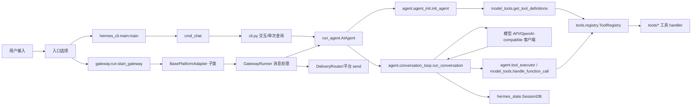

# Hermes Agent 源码分析报告

日期：2026-05-25

## 源码分析概览

- 项目类型：Python AI Agent / CLI / 多平台消息网关 / 工具调用框架
- 技术栈：Python 3.11+、OpenAI-compatible Chat Completions/Responses API、prompt_toolkit、SQLite FTS5、asyncio、FastAPI 可选 Web UI、Docker/Nix 打包
- 主要入口：
  - `hermes`：`hermes_cli.main:main`，见 `pyproject.toml:209`
  - `hermes-agent`：`run_agent:main`，见 `pyproject.toml:211`
  - `hermes-acp`：`acp_adapter.entry:main`，见 `pyproject.toml:212`
- 核心目标：提供一个可在 CLI、TUI、Telegram/Discord/Slack/WhatsApp 等平台运行的工具调用 Agent，支持长期会话、记忆、技能、Cron、子代理和多模型后端。

## 项目结构

```text
.
├── hermes_cli/          # hermes 命令行入口、配置、setup、dashboard、插件、会话命令
├── cli.py               # 经典交互式终端聊天 UI，基于 prompt_toolkit
├── run_agent.py         # AIAgent 门面类与直接运行入口，核心逻辑大量转发到 agent/
├── agent/               # Agent 初始化、对话循环、模型适配、提示词、工具执行、压缩、记忆
├── tools/               # 内置工具实现与工具注册表
├── toolsets.py          # 工具集定义：web/file/terminal/browser/memory/delegation 等
├── model_tools.py       # 工具发现、schema 过滤、工具调用分发的兼容层
├── gateway/             # 多平台消息网关、session、delivery、adapter 基类与平台实现
├── cron/                # Cron/定时任务调度
├── acp_adapter/         # ACP/Zed 等编辑器协议适配
├── hermes_state.py      # SQLite state.db，会话、消息、FTS 搜索与用量统计
├── plugins/             # 插件体系
├── providers/           # provider 相关扩展
├── tests/               # pytest 测试
├── web/ ui-tui/         # Web/TUI 前端相关源码
├── Dockerfile docker/   # 容器运行与 s6 服务
├── pyproject.toml       # 包元数据、依赖、入口点、pytest/ruff/ty 配置
└── README.md            # 项目介绍与使用方式
```

## 核心流程图



## 关键调用流程

### 1. CLI 启动流程

1. 包入口 `hermes = "hermes_cli.main:main"` 定义在 `pyproject.toml:209`。
2. `hermes_cli/main.py:11023` 的 `main()` 是 CLI 总入口，先做 Windows UTF-8 stdio、Termux 快速路径等启动优化。
3. `hermes_cli/_parser.py:82` 构建顶层 argparse parser，并注册 `chat`、`--oneshot`、`--model`、`--toolsets`、`--resume` 等通用参数。
4. `hermes_cli/main.py:1631` 的 `cmd_chat()` 负责聊天入口：处理 resume/continue、首次 setup、环境变量开关、TUI 分支。
5. 如果不是 TUI，`cmd_chat()` 在 `hermes_cli/main.py:1784` 导入并调用 `cli.py` 的 `main()`，进入经典交互式 CLI。

### 2. Agent 初始化流程

1. `run_agent.py:327` 定义 `AIAgent` 门面类。
2. `AIAgent.__init__()` 在 `run_agent.py:350` 接收 provider、model、toolsets、session、callbacks、gateway 上下文等大量参数。
3. 真实初始化逻辑转发到 `agent.agent_init.init_agent()`，见 `run_agent.py:417` 和 `agent/agent_init.py:139`。
4. 初始化阶段会：
   - 设置模型、最大迭代数、共享 iteration budget：`agent/agent_init.py:256`
   - 读取配置：`hermes_cli/config.py:4393`
   - 加载工具 schema：`agent/agent_init.py:55` 引入 `get_tool_definitions`
   - 准备上下文压缩、记忆、提示词、模型客户端、回调等运行状态。

### 3. 对话循环流程

1. `AIAgent.run_conversation()` 在 `run_agent.py:4154`，实际转发到 `agent.conversation_loop.run_conversation()`。
2. `agent/conversation_loop.py:232` 是单轮用户请求的核心循环，负责：
   - 恢复或构建 system prompt：`agent/conversation_loop.py:130`
   - 维护会话历史、token 预算、上下文压缩
   - 调用模型 API
   - 解析 tool calls
   - 顺序或并发执行工具
   - 持久化消息、用量、轨迹
   - 处理重试、fallback、provider 错误。
3. system prompt 构建通过 `run_agent.py:2307` 转发到 `agent.system_prompt.build_system_prompt()`。
4. OpenAI-compatible 客户端创建通过 `run_agent.py:2563` 转发到 `agent.agent_runtime_helpers.create_openai_client()`。

### 4. 工具系统流程

1. `tools/registry.py:57` 的 `discover_builtin_tools()` 扫描 `tools/*.py`，只导入顶层调用 `registry.register(...)` 的工具模块。
2. `tools/registry.py:151` 的 `ToolRegistry` 是工具注册中心。
3. 每个工具通过 `ToolRegistry.register()` 注册 schema、handler、toolset、availability check，见 `tools/registry.py:234`。
4. `model_tools.py:264` 的 `get_tool_definitions()` 根据启用/禁用 toolsets 过滤可用工具，并带缓存。
5. `toolsets.py:88` 定义内置工具集，例如 `web`、`terminal`、`file`、`browser`、`memory`、`delegation`。
6. 模型产生 tool call 后，`model_tools.py:741` 的 `handle_function_call()` 做参数类型修正、插件 hook、编辑审批、安全通知，然后调用 `registry.dispatch()`。
7. `tools/registry.py:390` 的 `dispatch()` 执行具体 handler；async handler 会通过 `model_tools._run_async()` 桥接。

### 5. Gateway 多平台流程

1. `gateway/run.py:17969` 的 `start_gateway()` 是消息网关主入口，包含重复实例/PID 锁处理。
2. `gateway/run.py:1626` 的 `GatewayRunner` 管理平台适配器、会话、delivery、Agent 缓存、pending/queued 消息、模型覆盖、语音模式等。
3. 平台配置由 `gateway/config.py:452` 的 `GatewayConfig` 表达，内含平台列表、reset policy、home channel、streaming、session 隔离策略。
4. 所有平台适配器继承 `gateway/platforms/base.py:1389` 的 `BasePlatformAdapter`。
5. 收到消息后，`BasePlatformAdapter.handle_message()` 在 `gateway/platforms/base.py:3163` 启动后台任务，支持：
   - 活跃 session guard
   - `/stop`、`/new`、`/reset` 等旁路命令
   - clarify/approval 等阻塞场景直达
   - 忙碌时消息排队与去抖。
6. Gateway session 由 `gateway/session.py:668` 的 `SessionStore` 管理，优先使用 SQLite，失败时回退 JSONL/session index。

### 6. 状态与会话持久化

1. `hermes_state.py:311` 定义 `SessionDB`。
2. schema 在 `hermes_state.py:185` 起定义，包括：
   - `sessions`
   - `messages`
   - `state_meta`
   - `messages_fts`
3. 设计目标写在文件头部：SQLite WAL、FTS5、session metadata、完整消息历史、压缩后的 parent session 链，见 `hermes_state.py:5`。
4. WAL 不可用时会回退到 DELETE journal mode，避免 NFS/SMB/FUSE 上整个会话系统不可用，见 `hermes_state.py:128`。

## 代码结构说明

### CLI 层：`hermes_cli/` + `cli.py`

- 位置：
  - `hermes_cli/main.py`
  - `hermes_cli/_parser.py`
  - `cli.py`
- 职责：
  - 提供 `hermes` 命令族。
  - 管理 setup/model/tools/config/gateway/sessions/dashboard 等子命令。
  - 启动经典 CLI 或 TUI。
- 关键对象/函数：
  - `main()`：`hermes_cli/main.py:11023`
  - `cmd_chat()`：`hermes_cli/main.py:1631`
  - `build_top_level_parser()`：`hermes_cli/_parser.py:82`
- 依赖关系：
  - CLI 层最终构造 `run_agent.AIAgent` 或调用 gateway 管理命令。
  - 配置读取依赖 `hermes_cli/config.py`。

### Agent 运行时：`run_agent.py` + `agent/`

- 位置：
  - `run_agent.py`
  - `agent/agent_init.py`
  - `agent/conversation_loop.py`
  - `agent/tool_executor.py`
  - `agent/system_prompt.py`
- 职责：
  - 抽象一次 Agent 会话。
  - 维护模型客户端、工具 schema、会话上下文、记忆、提示词、压缩、fallback。
  - 执行模型调用—工具调用—模型继续的循环。
- 关键对象/函数：
  - `AIAgent`：`run_agent.py:327`
  - `init_agent()`：`agent/agent_init.py:139`
  - `run_conversation()`：`agent/conversation_loop.py:232`
- 架构特点：
  - `run_agent.py` 现在更像兼容门面；长逻辑已拆到 `agent/`，但保留很多 forwarder 以兼容测试 patch 路径。
  - 支持多 provider、多 API mode、fallback、reasoning、prompt caching、trajectory 保存。

### 工具系统：`tools/` + `model_tools.py` + `toolsets.py`

- 位置：
  - `tools/registry.py`
  - `model_tools.py`
  - `toolsets.py`
  - `tools/*.py`
- 职责：
  - 工具自注册。
  - 将 toolset 解析成具体工具名。
  - 生成 OpenAI-format function schema。
  - 将模型 tool call 派发到具体 handler。
- 关键对象/函数：
  - `ToolRegistry`：`tools/registry.py:151`
  - `discover_builtin_tools()`：`tools/registry.py:57`
  - `get_tool_definitions()`：`model_tools.py:264`
  - `handle_function_call()`：`model_tools.py:741`
  - `TOOLSETS`：`toolsets.py:88`
- 扩展点：
  - 新工具通常在 `tools/` 下实现，并在模块顶层调用 `registry.register(...)`。
  - 新工具集可扩展 `toolsets.py`。
  - MCP/插件也可动态注册工具。

### Gateway 层：`gateway/`

- 位置：
  - `gateway/run.py`
  - `gateway/session.py`
  - `gateway/config.py`
  - `gateway/platforms/base.py`
  - `gateway/platforms/*.py`
- 职责：
  - 连接 Telegram/Discord/Slack/WhatsApp/Signal/Email 等平台。
  - 把平台消息转换为统一 `MessageEvent`。
  - 管理 session key、排队、打断、delivery、home channel、voice/STT/TTS。
- 关键对象/函数：
  - `GatewayRunner`：`gateway/run.py:1626`
  - `start_gateway()`：`gateway/run.py:17969`
  - `GatewayConfig`：`gateway/config.py:452`
  - `SessionStore`：`gateway/session.py:668`
  - `BasePlatformAdapter`：`gateway/platforms/base.py:1389`
  - `handle_message()`：`gateway/platforms/base.py:3163`
- 架构特点：
  - 平台适配器异步运行，消息处理通过 background task 避免阻塞接收循环。
  - Runner 层缓存 `AIAgent`，减少 system prompt 重建并保留 prompt cache 价值。

### 状态存储：`hermes_state.py`

- 位置：`hermes_state.py`
- 职责：
  - 管理 `~/.hermes/state.db`。
  - 存储 session、message、模型配置、token/费用、FTS 搜索。
- 关键结构：
  - `sessions`：`hermes_state.py:190`
  - `messages`：`hermes_state.py:224`
  - `messages_fts`：`hermes_state.py:256`
- 设计重点：
  - WAL 优先，网络文件系统失败时降级。
  - CLI 和 Gateway 共享会话历史基础设施。

## 关键工程特征

1. **入口多但核心复用**
   - CLI、TUI、Gateway、ACP 最终都复用 `AIAgent` 和工具系统。

2. **run_agent.py 是兼容门面**
   - 很多方法只是 forwarder，例如 `run_conversation()`、`_build_system_prompt()`、`_create_openai_client()`。
   - 真实逻辑主要在 `agent/` 子模块。

3. **工具系统是自注册架构**
   - `model_tools.py` 不再维护大表，而是触发 `tools.registry` discovery。
   - 工具可由内置模块、MCP、插件动态加入。

4. **Gateway 是长生命周期守护进程**
   - 有 PID/lock、adapter reconnect、session cache、agent cache、queued messages、typing indicator、语音模式等复杂运行时状态。

5. **配置和依赖强调安全与可控**
   - `pyproject.toml:13` 起依赖精确 pin。
   - 配置读取有缓存和解析失败警告。
   - 工具调用前有 hook、ACP edit approval、危险命令/文件变更 guardrail 等路径。

## 可继续深入的方向

- 深入 `agent/conversation_loop.py`：模型调用、tool call 解析、重试、fallback 的完整状态机。
- 深入 `agent/tool_executor.py`：并发工具调用、路径冲突、工具结果预算。
- 深入某个平台适配器，例如 `gateway/platforms/telegram.py` 或 `gateway/platforms/discord.py`。
- 深入配置体系：`hermes_cli/config.py` 的 `DEFAULT_CONFIG`、迁移、`cfg_get`。
- 深入插件系统：`hermes_cli/plugins.py` 如何注册工具、平台、hook、provider。
- 深入安全边界：`agent/tool_guardrails.py`、`agent/file_safety.py`、`tools/approval.py`、`tools/terminal_tool.py`。
